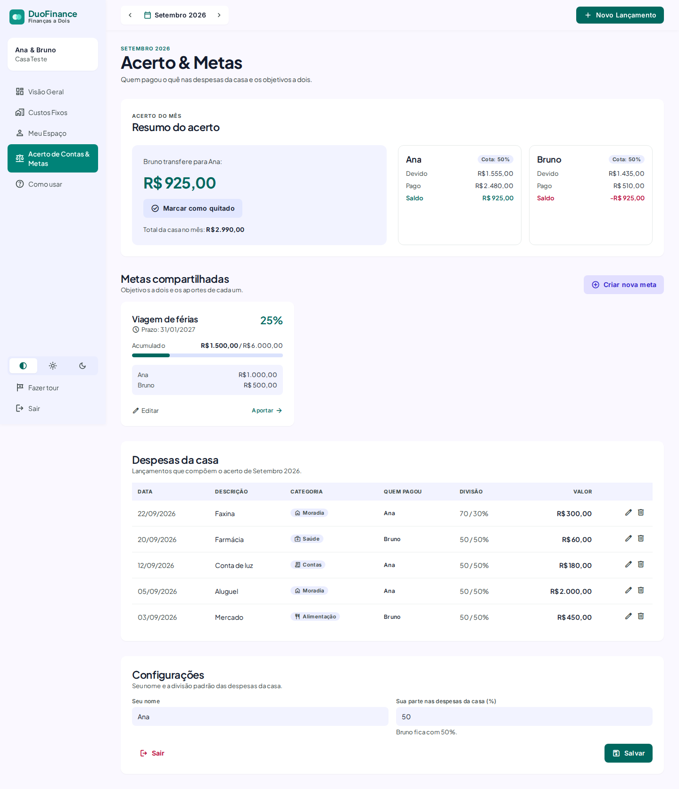

# DuoFinance

Um app pequeno que eu fiz pra minha namorada e eu controlarmos o dinheiro de casa sem planilha e sem ficar fazendo conta de cabeça no fim do mês.

A ideia é simples:

- **Casa** — o que é dos dois (aluguel, mercado, luz). Os dois veem, e o app calcula quem deve quanto pra quem.
- **Pessoal** — o que é só seu. Ninguém mais vê: nem os lançamentos, nem o total. Nada de um ficar controlando o gasto do outro.


## O que dá pra fazer

- **Lançar gastos** da casa ou pessoais, dizendo quem pagou.
- **Acerto do mês**: o app soma o que cada um pagou das contas da casa e diz "Fulano transfere R$ X pra Ciclano". Divide 50/50 por padrão; dá pra mudar o padrão (ex.: 60/40) ou só um gasto específico (ex.: aluguel 70/30). Depois de transferir, é só marcar como quitado.
- **Contas fixas**: cadastra aluguel, condomínio, internet… e todo mês vê o que está pago, pendente ou vencido. "Marcar como paga" já lança a despesa.
- **Metas a dois**: viagem, reserva de emergência, com os aportes de cada um.
- **Tema claro e escuro**, versão de celular e dá pra instalar como app ("Adicionar à tela inicial").
- **Tour guiado** no primeiro acesso e uma página "Como usar" com o passo a passo.

| Contas fixas | Acerto & metas |
|---|---|
|  |  |

| Modo escuro | Celular |
|---|---|
|  |   |


<sub>Prints com dados de teste.</sub>

## Como o acerto funciona

Para cada gasto da **casa** no mês:

1. cada pessoa **deve** a parte dela (`valor × %`);
2. quem pagou **pagou** o valor inteiro.

`saldo = pago − devido`. Quem ficou negativo transfere a diferença pro outro, descontando o que já foi marcado como quitado naquele mês.

> Exemplo, 50/50: Ana pagou R$ 300 de mercado e Bruno pagou R$ 100 de luz. Total R$ 400, cada um deve R$ 200. Ana está +R$ 100, Bruno −R$ 100 → **Bruno transfere R$ 100 pra Ana.**

Gastos pessoais nunca entram no acerto. A lógica fica em [`src/lib/settlement.js`](src/lib/settlement.js), com testes.

## Stack

- [Vue 3](https://vuejs.org) + [Vite](https://vite.dev) + [Tailwind CSS](https://tailwindcss.com) — SPA estática, sem backend próprio.
- [Supabase](https://supabase.com) — Postgres, login e Row Level Security. Plano grátis.
- [driver.js](https://driverjs.com) — o tour guiado.
- GitHub Pages + GitHub Actions — deploy a cada push na `main`.

Custo total: R$ 0.

## Segurança

O site é estático e fala direto com o Supabase usando a *publishable key*, que é pública por design (ela vai no JavaScript de qualquer jeito). Quem protege os dados é o banco:

- **RLS em todas as tabelas**: cada usuário só enxerga a própria casa, e gastos pessoais só o próprio dono.
- Chaves estrangeiras compostas impedem apontar um gasto pra um membro ou conta de outra casa.
- Percentuais só mudam por uma função que mantém a soma em 100; `TRUNCATE` e acesso anônimo revogados; tamanho de texto limitado.
- Cadastro público desligado: só os usuários criados à mão entram. Mesmo que alguém consiga criar conta, não vê nada.
- CSP via `<meta>` no build, actions do workflow fixadas por SHA.

As migrations foram testadas com scripts de ataque (ler/escrever na casa dos outros, se infiltrar numa casa, ler gasto pessoal do parceiro…) antes de publicar.

**Nunca** coloque a *secret key* / `service_role` no front, no `.env` ou nas variáveis do GitHub.

## Quer usar também?

Faz um fork e segue:

### 1. Supabase

1. Crie um projeto em [supabase.com](https://supabase.com) (região São Paulo, se for do Brasil).
2. No **SQL Editor**, rode em ordem cada arquivo de [`supabase/migrations/`](supabase/migrations).
3. **Authentication → Sign In / Providers**: desligue *Allow new users to sign up*.
4. **Authentication → Users → Add user**: crie os dois usuários (marque *Auto Confirm*).
5. Edite e-mails e nomes em [`supabase/seed.sql`](supabase/seed.sql) e rode no SQL Editor (não faça commit disso com os dados reais).
6. Recomendado: **Authentication → Passwords** com mínimo de 12 caracteres e proteção contra senhas vazadas.

### 2. Rodando local

```bash
cp .env.example .env   # URL do projeto + publishable key (Settings → API Keys)
npm install
npm run dev            # http://localhost:5173
npm test
```

### 3. Publicando no GitHub Pages

1. **Settings → Pages → Source**: *GitHub Actions*.
2. **Settings → Secrets and variables → Actions → Variables**: crie `VITE_SUPABASE_URL` e `VITE_SUPABASE_ANON_KEY` (a publishable key).
3. Push na `main`. O workflow roda os testes, faz o build e publica.
4. No Supabase, **Authentication → URL Configuration**: coloque a URL do Pages como *Site URL*.

## Estrutura

```
src/
  views/        telas (Visão Geral, Custos Fixos, Meu Espaço, Acerto & Metas, Como usar, Login)
  components/   layout, formulário de lançamento e peças de cada tela
  lib/          store (Supabase), acerto, dinheiro, mês, tema, tour
supabase/
  migrations/   schema + RLS, rode em ordem
  seed.sql      cria a casa e os dois membros
docs/spec.md    decisões e regras do app
```
